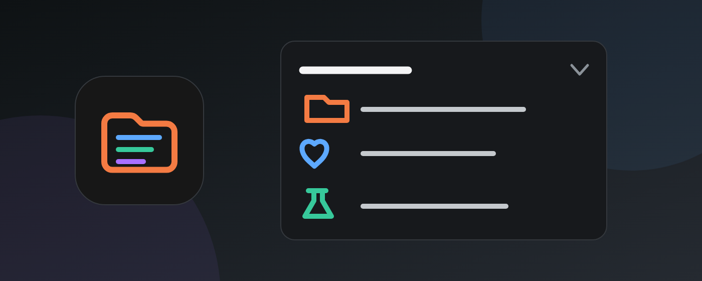
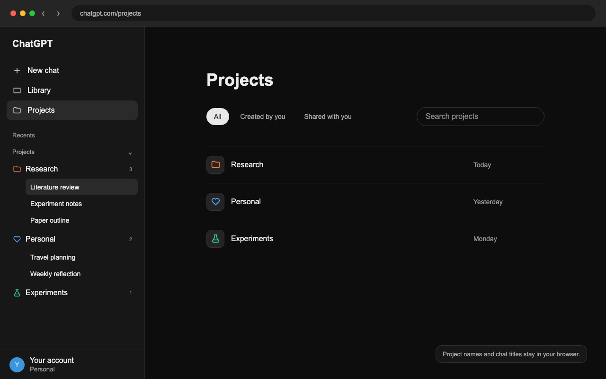
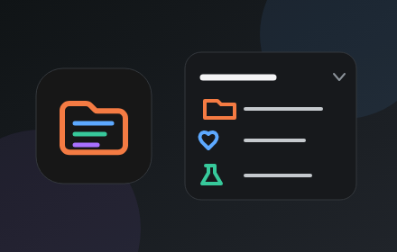

# Project Sidebar for ChatGPT

A privacy-first Chrome extension that groups ChatGPT's recent conversations under their projects, similar to the desktop ChatGPT sidebar.



## Preview



### Store artwork



## What it does

- Groups project-tagged conversations in the ChatGPT web sidebar.
- Keeps non-project conversations in the normal **Recents** list.
- Learns a project's complete conversation list whenever you visit that project's page.
- Stores learned project metadata locally in Chrome extension storage.
- Uses ChatGPT's rendered DOM only—no private APIs, cookies, tokens, analytics, or external servers.
- Shows a clear first-run disclosure before reading or storing project information.

## Install locally

1. Open `chrome://extensions` in Chrome.
2. Enable **Developer mode**.
3. Click **Load unpacked**.
4. Select this folder:

   Select the cloned `chatgpt-project-sidebar` folder.

5. Reload an existing `chatgpt.com` tab.

## Populate full project lists

The sidebar can immediately group project conversations that are already visible in **Recents**. To learn older conversations:

1. Open `https://chatgpt.com/projects`.
2. Open a project.
3. The extension remembers the complete chat list rendered on that project page.
4. Repeat once for each project whose complete history you want in the sidebar.

This deliberate browsing-based approach avoids depending on ChatGPT's undocumented backend APIs.

## Development

```bash
npm test
npm run check
```

There is no build step. After editing, click **Reload** on the extension card in `chrome://extensions` and refresh ChatGPT.

## Current limitations

- Project URLs and full histories are learned when their project pages are visited.
- If ChatGPT substantially changes its accessible labels or sidebar DOM, the selectors in `src/content.js` may need updating.
- The extension affects `chatgpt.com` only.

## Privacy

All learned names and URLs remain in `chrome.storage.local`. The extension makes no network requests of its own and sends no data anywhere.

Read the complete [privacy policy](PRIVACY.md).

## Disclaimer

This is an independent, unofficial extension and is not affiliated with, endorsed by, or sponsored by OpenAI. ChatGPT is a trademark of OpenAI.

## License

[MIT](LICENSE)
